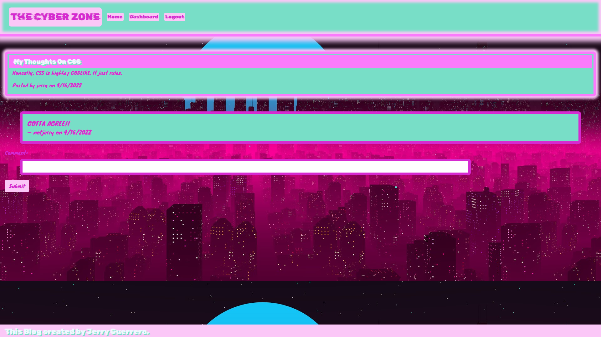
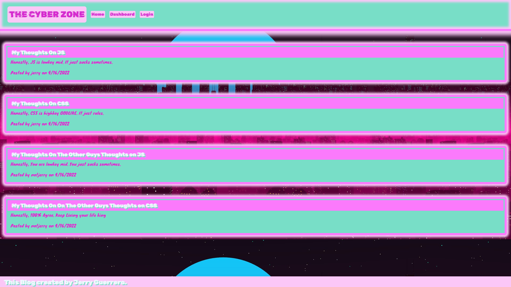

# The_CYBER_Zone 

A blog all about tech entitled THE CYBER ZONE. Feel free to post all about whatever tech or tech news you'd like to.

## Table of Contents

- [Tech](#tech)
- [Installation](#installation)
- [Usage](#usage)
- [Contributing](#contributing)
- [Questions](#questions)
- [License](#license)

## Tech

---

The following technology was used in this project: HANDLEBARS, CSS, JAVASCRIPT, EXPRESS, NODE, BCRYPT, DOTENV, MYSQL and SEQUELIZE

## Installation

---

Being that this is a web application, there is no install necessary!

## Usage

---

In order to use this app, you simply need to go to the website (linked below) and sign up. From there you can view all the blogs that have been posted as well as comment on them or maybe even create your own!

## Contributing

---

This project is considered finished, if it fancies you then feel free to add a post to the blog!

## Images

---

## Questions

---

For any questions you can reach out to me using the following methods:

Email: JerryGDev126@gmail.com

GitHub: https://github.com/JGuerrero126

## License

---

This project is protected under the Apache license and all relevant protections are granted.
